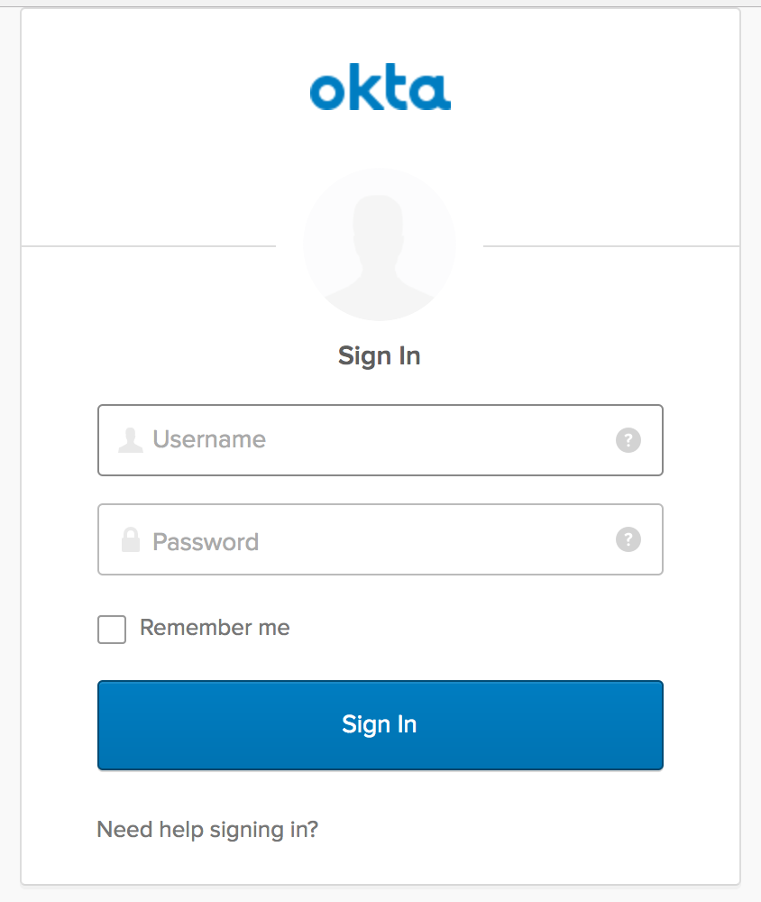

# Okta Flask Sample Application

### Table of Contents

  - [Introduction](#introduction)
    - [Login Redirect](#1-login-redirect)
    - [Custom Login Form](#2-custom-login-form)
  - [Prerequisites](#prerequisites)
  - [Quick Start](#quick-start)
  - [Front End](#front-end)
    - [Login Redirect](#login-redirect)
    - [Custom Login Form](#custom-login-form)
    - [Using a different front-end](#using-a-different-front-end)
  - [Back End](#back-end)
    - [Routes](#routes)
    - [Handle the Redirect](#handle-the-redirect)
    - [Code Exchange](#code-exchange)
    - [Validation](#validation)
  - [Set User Session](#set-user-session)
  - [Logout](#logout)
  - [Conclusion](#conclusion)
  - [Support](#support)
  - [License](#license)

## Introduction

This tutorial will demonstrate how to use OAuth 2.0 and OpenID Connect to add authentication to a Flask application.  The front-end is an Angular.js application and it shows the following use cases:

#### Login Redirect

Users are redirected to your Okta organization for authentication.



After logging into your Okta organization, an authorization code is returned in a callback URL. This authorization code is then exchanged for an `id_token`.

#### Custom Login Form

The Okta Sign-In Widget is a fully customizable login experience. You can change how the widget [looks with CSS](http://developer.okta.com/code/javascript/okta_sign-in_widget#customizing-style-with-css) and [is configured with JavaScript](http://developer.okta.com/code/javascript/okta_sign-in_widget#customizing-widget-features-and-text-labels-with-javascript).


This custom-branded login experience uses the [Okta Sign-In Widget](http://developer.okta.com/code/javascript/okta_sign-in_widget) to perform authentication, returning an authorization code that is then exchanged for an `id_token`.

## Prerequisites

Before running this sample, you will need the following:

* An Okta Developer Account, you can sign up for one at https://developer.okta.com/signup/.
* An Okta Application, configured for Web mode. This is done from the Okta Developer Console and you can find instructions [here][OIDC Web Application Setup Instructions].  When following the wizard, use the default properties.  They are designed to work with our sample applications.

## Installation

This sample app depends on [Node.js](https://nodejs.org/en/) to build the front-end application.  If you don't have it, install it from [nodejs.org](https://nodejs.org/en/).

```bash
# Verify that node is installed
$ node -v
```

Then, clone this sample from GitHub and install the front-end dependencies:
```bash
# Clone the repo and navigate to the samples-python-flask dir
$ git clone git@github.com:okta/samples-python-flask.git
$ cd samples-python-flask

# Install the front-end dependencies
[samples-python-flask]$ npm install
```

We assume you are using virtualenv.  Use virtualenv to start a new environment for this project:

```bash
[samples-python-flask]$ virtualenv .
[samples-python-flask]$ source bin/activate
[samples-python-flask]$ pip install -r requirements.txt
```

Note: if on OSX you may get a failure when building cryptography, if so please see https://github.com/pyca/cryptography/issues/2692#issuecomment-272773481

## Running This Example

You need to gather the following information from the Okta Developer Console:

- **Client ID** and **Client Secret** - This can be found on the "General" tab of an application, you want to get this for the Web application that you created earlier.

- **Issuer** - This is the URL of the authorization server that will perform authentication.  All Developer Accounts have a "default" authorization server.  The issuer is a combination of your Org URL (found in the upper right of the console home page) and `/oauth2/default`. For example, `https://dev-1234.oktapreview.com/oauth2/default`.

Now place these values into the file `.samples.config.json` that was created for you in the root of this project:

```javascript
// .samples.config.json
{
  "oktaSample": {
    "oidc": {
      "oktaUrl": "https://{yourOktaDomain}.com",
      "issuer": "https://{yourOktaDomain}.com/oauth2/default",
      "clientId": "{clientId}",
      "clientSecret": "{clientSecret}",
      "redirectUri": "http://localhost:8080/authorization-code/callback"
    },
    "server": {
      "staticDir": "dist",
      "port": 8080,
      "framework": "Flask",
      "environment": "Python"
    }
  }
}

```

Now start the app server.  We wrap the python script with `npm start`, which will also build the front-end application:

```
npm start
```

Now navigate to http://localhost:8080 in your browser.

If you see a home page that prompts you to login, then things are working!  Clicking the **Log in** button will redirect you to the Okta hosted sign-in page.

You can login with the same account that you created when signing up for your Developer Org, or you can use a known username and password from your Okta Directory.

**Note:** If you are currently using your Developer Console, you already have a Single Sign-On (SSO) session for your Org.  You will be automatically logged into your application as the same user that is using the Developer Console.  You may want to use an incognito tab to test the flow from a blank slate.

## Front-end

When you start this sample, the [Okta AngularJS 1.x Example](https://github.com/okta/samples-js-angular-1) is copied into the `dist/` directory. More information about the AngularJS controllers and views are available in the [AngularJS project repository](https://github.com/okta/samples-js-angular-1/blob/master/README.md).

### Login Redirect

With AngularJS, we include the template directive `ng-click` to begin the login process. When the link is clicked, it calls the `login()` function defined in `login-redirect.controller.js`. Let’s take a look at how the `OktaAuth` object is created.

```javascript
// login-redirect.controller.js

class LoginRedirectController {
   constructor(config) {
    this.config = config;
  }
   $onInit() {
    this.authClient = new OktaAuth({
      url: this.config.oktaUrl,
      issuer: this.config.issuer,
      clientId: this.config.clientId,
      redirectUri: this.config.redirectUri,
      scopes: ['openid', 'email', 'profile'],
    });
  }

  login() {
    this.authClient.token.getWithRedirect({ responseType: 'code' });
  }
}
```

There are a number of different ways to construct the login redirect URL.

1. Build the URL manually
2. Use an OpenID Connect / OAuth 2.0 middleware library
3. Use [AuthJS](http://developer.okta.com/code/javascript/okta_auth_sdk)

In this sample, we use AuthJS to create the URL and perform the redirect. An `OktaAuth` object is instantiated with the configuration in `.samples.config.json`. When the `login()` function is called from the view, it calls the [`/authorize`](http://developer.okta.com/docs/api/resources/oauth2.html#authentication-request) endpoint to start the [Authorization Code Flow](https://tools.ietf.org/html/rfc6749#section-1.3.1).

You can read more about the `OktaAuth` configuration options here: [OpenID Connect with Okta AuthJS SDK](http://developer.okta.com/code/javascript/okta_auth_sdk#social-authentication-and-openid-connect).

**Important:** When the authorization code is exchanged for an `access_token` and/or `id_token`, the tokens **must** be [validated](#validation). We'll cover that in a bit.

### Custom Login Form
To render the [Okta Sign-In Widget](http://developer.okta.com/code/javascript/okta_sign-in_widget), include a container element on the page for the widget to attach to:

```html
<!-- overview.mustache -->
<div id="sign-in-container"></div>
```

Then, initialize the widget with the [OIDC configuration](https://github.com/okta/okta-signin-widget#openid-connect) options:
``` javascript
// login-custom.controller.js
class LoginCustomController {
  constructor(config) {
    this.config = config;
  }

  $onInit() {
    const signIn = new SignIn({
      baseUrl: this.config.oktaUrl,
      clientId: this.config.clientId,
      redirectUri: this.config.redirectUri,
      authParams: {
        issuer: this.config.issuer,
        responseType: 'code',
        scopes: ['openid', 'email', 'profile'],
      },
    });
    signIn.renderEl({ el: '#sign-in-container' }, () => {});
  }
}
```
To perform the [Authorization Code Flow](https://tools.ietf.org/html/rfc6749#section-1.3.1), we set the `responseType` to `code`. This returns an `access_token` and/or `id_token` through the [`/token`](http://developer.okta.com/docs/api/resources/oauth2.html#token-request) OpenID Connect endpoint.

**Note:** Additional configuration for the `SignIn` object is available at [OpenID Connect, OAuth 2.0, and Social Auth with Okta](https://github.com/okta/okta-signin-widget#configuration).

### Using a different front-end

At the moment this Flask example only comes with the Angular.js front-end example.  We do have other standalone front-end samples for these frameworks:

* [Okta Angular Sample Projects](https://github.com/okta/samples-js-angular)
* [Okta React Sample Projects](https://github.com/okta/samples-js-react)
* [Okta Vue Sample Projects](https://github.com/okta/samples-js-vue)

## Back-end
To complete the [Authorization Code Flow](https://tools.ietf.org/html/rfc6749#section-1.3.1), your back-end server performs the following tasks:
  - Handle the [Authorization Code code exchange](https://tools.ietf.org/html/rfc6749#section-1.3.1) callback
  - [Validate](http://openid.net/specs/openid-connect-core-1_0.html#IDTokenValidation) the `id_token`
  - Set `user` session in the app
  - Log the user out

### Routes
To render the AngularJS templates, we define the following Flask routes:

| Route                                 | Description                                                 |
| ------------------------------------- | ----------------------------------------------------------- |
| **authorization-code/login-redirect** | renders the [login redirect](#login-redirect) flow          |
| **authorization-code/login-custom**   | renders the [custom login](#custom-login-form) flow         |
| **authorization-code/callback**       | handles the redirect from Okta                              |
| **authorization-code/profile**        | renders the logged in state, displaying profile information |
| **authorization-code/logout**         | closes the `user` session                                   |

### Handle the Redirect
After successful authentication, an authorization code is returned to the redirectUri:
```
http://localhost:3000/authorization-code/callback?code={{code}}&state={{state}}
```

Two cookies are created after authentication: `okta-oauth-nonce` and `okta-auth-state`. You **must** verify the returned `state` value in the URL matches the `state` value created.

In this sample, we verify the state here:

```python
cookies = request.cookies
if (('okta-oauth-nonce' in cookies) and ('okta-oauth-state' in cookies)):
    nonce = cookies['okta-oauth-nonce']
    state = cookies['okta-oauth-state']
else:
    return "invalid nonce or state", 401
if (request.args.get('state') != state):
    err = "'{}' != '{}'".format(
        request.args.get('state'),
        state)
    return "invalid state: {}".format(err), 401
```

### Code Exchange
Next, we exchange the returned authorization code for an `id_token` and/or `access_token`. You can choose the best [token authentication method](http://developer.okta.com/docs/api/resources/oauth2.html#token-request) for your application. In this sample, we use the default token authentication method `client_secret_basic`:

```python
auth = HTTPBasicAuth(config['oidc']['clientId'],
                     config['oidc']['clientSecret'])
querystring = {
    'grant_type': 'authorization_code',
    'code': request.args.get('code'),
    'redirect_uri': config['oidc']['redirectUri']
}
url = "{}/v1/token".format(config['oidc']['issuer'])

qs = "grant_type=authorization_code&code={}&redirect_uri={}".format(
    urllib.quote_plus(querystring['code']),
    urllib.quote_plus(querystring['redirect_uri'])
    )
url = "{}/v1/token?{}".format(config['oidc']['issuer'], qs)

headers = {
    'User-Agent': None,
    'Connection': 'close',
    'Accept': 'application/json',
    'Content-Type': 'application/x-www-form-urlencoded'
}

r = requests.post(url,
                  stream=False,
                  auth=auth,
                  headers=headers)
return_value = r.json()
if 'id_token' not in return_value:
    return "no id_token in response from /token endpoint", 401
id_token = return_value['id_token']
```

A successful response returns an `id_token` which looks similar to:
```
eyJhbGciOiJSUzI1NiJ9.eyJzdWIiOiIwMHVpZDRCeFh3Nkk2VFY0bTBnMyIsImVtYWlsIjoid2VibWFzd
GVyQGNsb3VkaXR1ZGUubmV0IiwiZW1haWxfdmVyaWZpZWQiOnRydWUsInZlciI6MSwiaXNzIjoiaHR0cD
ovL3JhaW4ub2t0YTEuY29tOjE4MDIiLCJsb2dpbiI6ImFkbWluaXN0cmF0b3IxQGNsb3VkaXR1ZGUu
bmV0IiwiYXVkIjoidUFhdW5vZldrYURKeHVrQ0ZlQngiLCJpYXQiOjE0NDk2MjQwMjYsImV4cCI6MTQ0O
TYyNzYyNiwiYW1yIjpbInB3ZCJdLCJqdGkiOiI0ZUFXSk9DTUIzU1g4WGV3RGZWUiIsImF1dGhfdGltZSI
6MTQ0OTYyNDAyNiwiYXRfaGFzaCI6ImNwcUtmZFFBNWVIODkxRmY1b0pyX1EifQ.Btw6bUbZhRa89
DsBb8KmL9rfhku--_mbNC2pgC8yu8obJnwO12nFBepui9KzbpJhGM91PqJwi_AylE6rp-
ehamfnUAO4JL14PkemF45Pn3u_6KKwxJnxcWxLvMuuisnvIs7NScKpOAab6ayZU0VL8W6XAijQmnYTt
MWQfSuaaR8rYOaWHrffh3OypvDdrQuYacbkT0csxdrayXfBG3UF5-
ZAlhfch1fhFT3yZFdWwzkSDc0BGygfiFyNhCezfyT454wbciSZgrA9ROeHkfPCaX7KCFO8GgQEkGRoQ
ntFBNjluFhNLJIUkEFovEDlfuB4tv_M8BM75celdy3jkpOurg
```

### Validation
After receiving the `id_token`, we [validate](http://openid.net/specs/openid-connect-core-1_0.html#IDTokenValidation) the token and its claims to prove its integrity.

In this sample, we use a [JSON Object Signing and Encryption (JOSE)](https://github.com/mpdavis/python-jose) library to decode and validate the token.

There are a couple things we need to verify:

1. [Verify the signature](#verify-signature)
2. [Verify the *iss* (issuer), *aud* (audience), and *exp* (expiry) time](#verify-fields)
3. [Verify the *iat* (issued at) time](#verify-issued-time)
4. [Verify the *nonce*](#verify-nonce)

You can learn more about validating tokens in [OpenID Connect Resources](http://developer.okta.com/docs/api/resources/oidc.html#validating-id-tokens).

#### Verify signature
An `id_token` contains a [public key id](https://tools.ietf.org/html/rfc7517#section-4.5) (`kid`). To verify the signature, we use the [Discovery Document](http://developer.okta.com/docs/api/resources/oidc.html#openid-connect-discovery-document) to find the `jwks_uri`, which will return a list of public keys. It is safe to cache or persist these keys for performance, but Okta rotates them periodically. We strongly recommend dynamically retrieving these keys.

For example:
- If the `kid` has been cached, use it to validate the signature.
- If not, make a request to the `jwks_uri`. Cache the new `jwks`, and use the response to validate the signature.

```python
def fetch_jwk_for(id_token=None):
    if id_token is None:
        raise NameError('id_token is required')

    jwks_uri = "{}/v1/keys".format(config['oidc']['issuer'])

    unverified_header = jws.get_unverified_header(id_token)
    key_id = None
    if 'kid' in unverified_header:
        key_id = unverified_header['kid']
    else:
        raise ValueError('The id_token header must contain a "kid"')
    if key_id in public_key_cache:
        return public_key_cache[key_id]

    r = requests.get(jwks_uri)
    jwks = r.json()
    for key in jwks['keys']:
        jwk_id = key['kid']
        public_key_cache[jwk_id] = key

    if key_id in public_key_cache:
        return public_key_cache[key_id]
    else:
        raise RuntimeError("Unable to fetch public key from jwks_uri")
```

#### Verify fields

Verify the `id_token` from the [Code Exchange](#code-exchange) contains our expected claims:

  - The `issuer` is identical to the host where authorization was performed
  - The `clientId` stored in our configuration matches the `aud` claim
  - If the token expiration time has passed, the token must be revoked

```python
five_minutes_in_seconds = 300
leeway = five_minutes_in_seconds
jwt_kwargs = {
    'algorithms': 'RS256',
    'options': {
        'verify_at_hash': False,
        # Used for leeway on the "exp" claim
        'leeway': leeway
    },
    'issuer': config['oidc']['issuer'],
    'audience': config['oidc']['clientId']
    }
if 'access_token' in return_value:
    jwt_kwargs['access_token'] = return_value['access_token']
try:
    jwks_with_public_key = fetch_jwk_for(id_token)
    claims = jwt.decode(
        id_token,
        jwks_with_public_key,
        **jwt_kwargs)
except (jose.exceptions.JWTClaimsError,
        jose.exceptions.JWTError,
        jose.exceptions.JWSError,
        jose.exceptions.ExpiredSignatureError,
        NameError,
        ValueError), err:
    return str(err), 401
```

#### Verify issued time
The `iat` value indicates what time the token was "issued at". We verify that this claim is valid by checking that the token was not issued in the future, with some leeway for clock skew.

```python
time_now_with_leeway = datetime.utcnow() + timedelta(seconds=leeway)
acceptable_iat = calendar.timegm((time_now_with_leeway).timetuple())
if 'iat' in claims and claims['iat'] > acceptable_iat:
    return "invalid iat claim", 401
```

#### Verify nonce
To mitigate replay attacks, verify that the `nonce` value in the `id_token` matches the `nonce` stored in the cookie `okta-oauth-nonce`.

```python
if nonce != claims['nonce']:
    return "invalid nonce", 401
```

### Set user session
If the `id_token` passes validation, we can then set the `user` session in our application.

In a production app, this code would lookup the `user` from a user store and set the session for that user. However, for simplicity, in this sample we set the session with the claims from the `id_token`.

```python
session['user'] = {
    'email': claims['email'],
    'claims': claims
    }
```

### Logout
In Flask, you can clear the the user session by:

```python
session.clear()
```

The Okta session is terminated in our client-side code.

## Conclusion
You have now successfully authenticated with Okta! Now what? With a user's `id_token`, you have basic claims into the user's identity. You can extend the set of claims by modifying the `response_type` and `scopes` to retrieve custom information about the user. This includes `locale`, `address`, `phone_number`, `groups`, and [more](http://developer.okta.com/docs/api/resources/oidc.html#scopes).

## Support

Have a question or see a bug? Email developers@okta.com. For feature requests, feel free to open an issue on this repo. If you find a security vulnerability, please follow our [Vulnerability Reporting Process](https://www.okta.com/vulnerability-reporting-policy/).

## License

Copyright 2017 Okta, Inc. All rights reserved.

Licensed under the Apache License, Version 2.0 (the "License"); you may not use this file except in compliance with the License. You may obtain a copy of the License at http://www.apache.org/licenses/LICENSE-2.0.

Unless required by applicable law or agreed to in writing, software distributed under the License is distributed on an "AS IS" BASIS, WITHOUT WARRANTIES OR CONDITIONS OF ANY KIND, either express or implied. See the License for the specific language governing permissions and limitations under the License.

[OIDC Middleware Library]: https://github.com/okta/okta-oidc-js/tree/master/packages/oidc-middleware
[Authorization Code Flow]: https://developer.okta.com/authentication-guide/implementing-authentication/auth-code
[OIDC Web Application Setup Instructions]: https://developer.okta.com/authentication-guide/implementing-authentication/auth-code#1-setting-up-your-application
